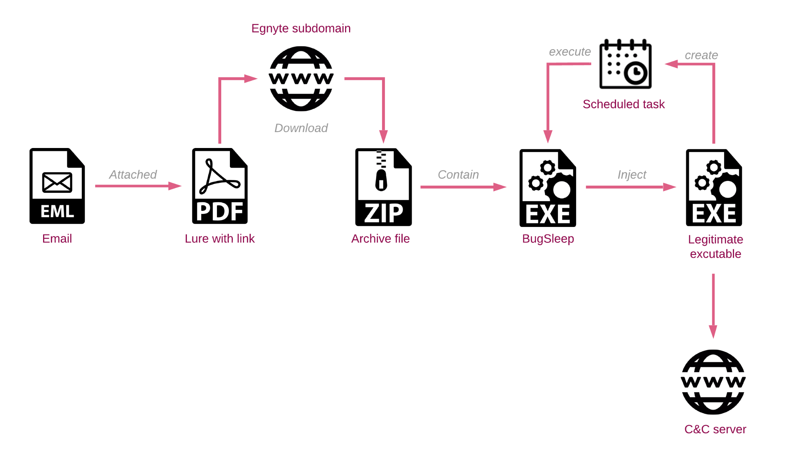
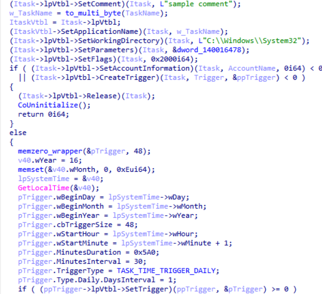
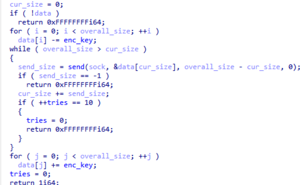

# BugSleep Technical Analysis

## Introduction

BugSleep is a new tailor-made malware used in MuddyWater phishing lures since May 2024, partially replacing their use of legitimate RMM tools. We discovered several versions of the malware being distributed, with differences between each version showing improvements and bug fixes (and sometimes creating new bugs). These updates, occurring within short intervals between samples, suggest a trial-and-error approach.

---

## Infection Chain

---

1. **Email Delivery**
   - The attack starts with a phishing email. The email is in EML format and contains an attachment, which is a PDF file.

2. **PDF with Lure Link**
   - The attached PDF file serves as a lure. It contains a link designed to trick the recipient into clicking it. The link points to a malicious Egnyte subdomain.

3. **Download Archive File**
   - When the recipient clicks the link in the PDF, they are redirected to an Egnyte subdomain where a ZIP archive file is downloaded. 
   - Egnyte is a legitimate file-sharing service, and attackers often use such services to host their malicious payloads to evade detection.

4. **ZIP File Contains EXE (BugSleep)**
   - The downloaded ZIP archive contains an executable file (EXE), referred to as "BugSleep." This EXE file is the initial malware payload.

5. **Execute Scheduled Task**
   - The "BugSleep" executable is configured to create a scheduled task on the infected system. The purpose of this task is to execute the EXE at specified times, ensuring persistence and continued execution of the malware.

6. **Inject into Legitimate Executable**
   - Once executed, the "BugSleep" malware injects itself into a legitimate executable. This is a common technique used to avoid detection by security software. By injecting into a legitimate process, the malware can blend in with normal system activity.

7. **Connect to C&C Server**
   - After the injection, the legitimate executable (now carrying the malware) establishes a connection with a Command and Control (C&C) server. This server is controlled by the attackers and is used to manage and control the infected systems.

---

### BugSleep Main Logic

- BugSleep’s main logic is similar in all versions, starting with many calls to the `Sleep` API to evade sandboxes and then it loads the APIs it needs to run properly.
- It then creates a mutex (we observed “PackageManager” and “DocumentUpdater” in our samples) and decrypts its configuration which includes the C&C IP address and port.
- All the configurations and strings are encrypted in the same way, where every byte is subtracted with the same hardcoded value.
- In most BugSleep samples, the malware then creates a scheduled task with the same name as the mutex and adds the comment "sample comment” to it.
- The scheduled task, which ensures persistence for BugSleep, runs the malware and is triggered every 30 minutes on a daily basis.

---

---

## BugSleep Communication and Commands

- The malware communication is also encrypted in the same way as its strings, adding 3 to every byte modulo 256.
- Every message exchanged between BugSleep and its C&C domain follows this format: [size_of_data][data].
- BugSleep starts by sending the ID of the victim, consisting of the computer name followed by the username, formatted as [computer_name][username].
- The malware has several commands it can perform based on the data sent from the C&C.

---

- BugSleep supports several commands from the C&C server:

| #   | Command         | Arguments      | Description                                             |
|-----|-----------------|----------------|---------------------------------------------------------|
| 1   | File name       |                | Send a file content to C&C.                            |
| 2   | File name       |                | Write content into a file.                             |
| 3   | Command         |                | Run commands through cmd pipe until 'terminate' command. |
| 4   | Timeout value   |                | Update ‘receive timeout’ with the new timeout value.   |
| 6   | –               |                | Stop communication.                                    |
| 9   | –               |                | Delete the persistence task.                           |
| 10  | –               |                | Get the status of the persistence task.                |
| 11  | –               |                | Create the persistence task.                           |
| 97  | Sleep time      |                | Update sleep time (not found in the first version).    |
| 98  | Timeout value   |                | Update receive timeout (not found in the first version).|
| 99  | –               |                | Sends the same value back (type of ping).              |

---

## Evasions

- In one of the malware versions, the developers implemented a couple of evasion methods from EDR solutions.
- First, the malware enables the `MicrosoftSignedOnly` flag of the `ProcessSignaturePolicy` structure to prevent the process from loading images that are not signed by Microsoft. This prevents other processes from injecting DLLs into the process.
- Next, it enables the `ProhibitDynamicCode` flag of the `ProcessDynamicCodePolicy` structure to prevent the process from generating dynamic code or modifying existing executable code.
- Enabling `ProcessDynamicCodePolicy` may be useful for protecting it from EDR solutions that hook userland API functions to inspect programs’ intents.

---

## BugSleep Loader

- One of the samples we analyzed came with a custom loader.
- The loader injects a shellcode that loads BugSleep in-memory into one of the following processes, based on whether they are already running:
  - `msedge.exe`
  - `opera.exe`
  - `chrome.exe`
  - `anydesk.exe`
  - `Onedrive.exe`
  - `powershell.exe`
- The shellcode in this case is also encrypted with the same algorithm as the strings in BugSleep but with a different shift: every byte is subtracted with a hardcoded value of 6.
- After decryption, the loader writes the shellcode inside the process with the `WriteProcessMemory` API and invokes the shellcode with the `CreateRemoteThread` API.

---

## Bugs and Unused Code

- Some of the samples contained several bugs, and parts of the code appear poorly written, with questionable omissions or additions that seem to be mistakes.
- One of the samples checks if the file “C:\users\public\a.txt” exists and if it doesn’t, it creates the file which it later deletes. The purpose of this code is not entirely clear and may be unfinished code inserted by the authors or borrowed from other places without fully understanding what the code does.
- In one sample, some of the API names were not encrypted like the others, probably due to lack of attention.
- In some samples, instead of properly encrypting (adding 3 to each byte), the malware runs the decryption algorithm (subtracting each byte by 3), which is probably by mistake.
- In a newer sample, the malware authors fixed that bug but did not do the same for all of the commands.
- Another questionable action is that the malware decrypts the data after it’s sent. We assume that their intent was to encrypt the strings again so they would not be seen in memory, but in this case, it does the opposite.

---

## Conclusion

BugSleep represents a significant development in MuddyWater’s TTPs, with advanced persistence and communication features. Its use of custom encryption and scheduled tasks highlights the sophistication of their operations. Continuous monitoring and analysis are essential to counteract this evolving threat.

---

For more details on MuddyWater’s recent campaigns, refer to the main report: [MuddyWater Campaign Analysis Report](README.md).
