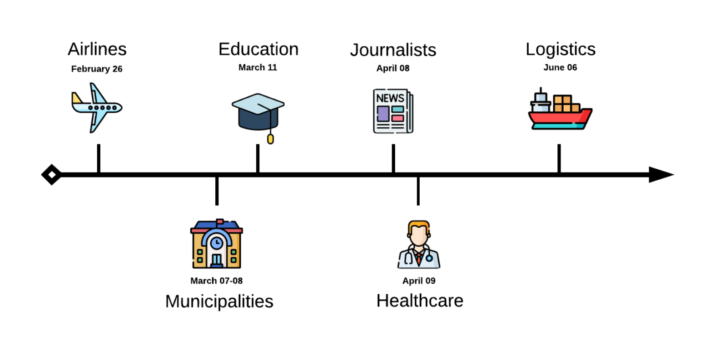

# MuddyWater Campaign Analysis Report

## Table of Contents
1. [Introduction](#introduction)
2. [Key Findings](#key-findings)
3. [BugSleep Analysis](#bugsleep-analysis)
4. [Emails and Lures](#emails-and-lures)
5. [Targets](#targets)
6. [Conclusion](#conclusion)
7. [Source](#source)

---

## Introduction

- **Report Reference:** [MWR01] 
- **Summarized by:** [InfoSec]  
- **Analysis Date:** [2024/7/15]  
- **Report Date:** [2024/7/15]

This report provides an analysis of the recent phishing campaigns and how they reflect the MuddyWater group’s interests. All features of the malware are listed below:

- MuddyWater, an Iranian threat group affiliated with the Ministry of Intelligence and Security (MOIS), is active since at least 2017. 
- Over the past year, MuddyWater engaged in widespread phishing campaigns targeting the Middle East, with a focus on Israel. Activities have surged since October 2023.
- Their methods remain consistent, using phishing campaigns from compromised email accounts targeting various organizations. Recently, they deployed a custom backdoor, BugSleep.

---

## Key Findings

- MuddyWater, an Iranian threat group, has increased its activities in Israel significantly since the Israel-Hamas war began in October 2023, also targeting Saudi Arabia, **Turkey**, Azerbaijan, India, and Portugal.
- They consistently use phishing campaigns from compromised email accounts. These campaigns typically lead to the deployment of legitimate Remote Management Tools (RMM) such as Atera Agent and Screen Connect.
- Recently, MuddyWater campaigns have also led to the deployment of a new, previously undocumented tailor-made backdoor known as BugSleep, targeting organizations in Israel.
- BugSleep is a backdoor designed to execute commands and transfer files between the compromised machine and the C&C server. It is still under development, with ongoing improvements and bug fixes.

---

## BugSleep Analysis

For a detailed technical analysis and infection chain of BugSleep [BugSleep Technical Analysis](BugSleepAnalysis.md)

---

## Emails and Lures

- MuddyWater campaigns usually consist of sending large numbers of emails from compromised email accounts.
- The lures are aimed at a broad range of organizations or individuals but often focus on specific industries or sectors.
- Since February 2024, over 50 spear phishing emails targeting more than 10 sectors were identified, sent to hundreds of recipients.
- Recent campaigns have shifted to more generic-themed phishing lures, such as invitations to webinars and online courses, allowing reuse across different targets and regions. English is now used more frequently, alongside locally spoken languages.
- Attribution to MuddyWater is supported by their consistent use of distinct behavior patterns and RMM tools observed in their operations over the years.

---

- In each of these campaigns, the actors used a tailored lure that was sent to dozens of targets in the same sector. For example, lures aimed at municipalities contained a suggestion to download a new app created just for municipalities:
-In more recent campaigns, the group shifted to more generic-themed, yet well-crafted phishing lures, such as invitations to webinars and online courses. This approach allows them to reuse the same lure across different targets and regions. Additionally, while they primarily used the locally spoken languages of their targets, they now use the English language more frequently.
- This shift is exemplified in two different emails that use the same exact lure: one sent to targets in Saudi Arabia and the other to Israel. The main differences were the email addresses used to send them, and the final payload. In Saudi Arabia it was an RMM, and in Israel, the custom backdoor BugSleep.
- Comparison of two emails about online courses using the same lure:

| **Characteristics of Email** | **Version 1** | **Version 2** |
|------------------------------|---------------|---------------|
| **From**                     | A compromised email account of a Saudi Arabian company. | A compromised email account of an Israeli company. |
| **To**                       | Companies in Saudi Arabia. | Companies in Israel. |
| **Link**                     | Email includes a direct link to an Egnyte subdomain. | Email contains a PDF attachment with an embedded link. |
| **Payload**                  | Atera RMM tool. | BugSleep backdoor. |

---

## Targets

- MuddyWater campaigns target a diverse array of sectors, including government entities, municipalities, media outlets, and travel agencies.
- Most emails were directed at companies in Israel, with others targeting entities in Turkey, Saudi Arabia, India, and Portugal.
- Files associated with the latest campaign were also uploaded to VirusTotal from IP locations including Azerbaijan and Jordan.

---

## Conclusion

The increased activity of MuddyWater in the Middle East, particularly in Israel, highlights the persistent nature of these threat actors. Their consistent use of phishing campaigns, now incorporating the custom backdoor BugSleep, marks a notable development in their techniques, tactics, and procedures (TTPs). The campaigns focus on specific sectors but have shifted to simpler, more generic lures and increased use of English to target a larger audience.

---

## Source 

[New BugSleep Backdoor Deployed in Recent MuddyWater Campaigns](https://research.checkpoint.com/2024/new-bugsleep-backdoor-deployed-in-recent-muddywater-campaigns/)
